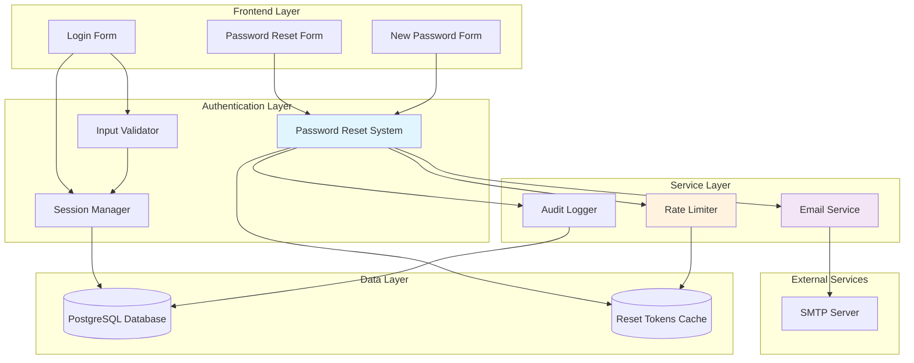
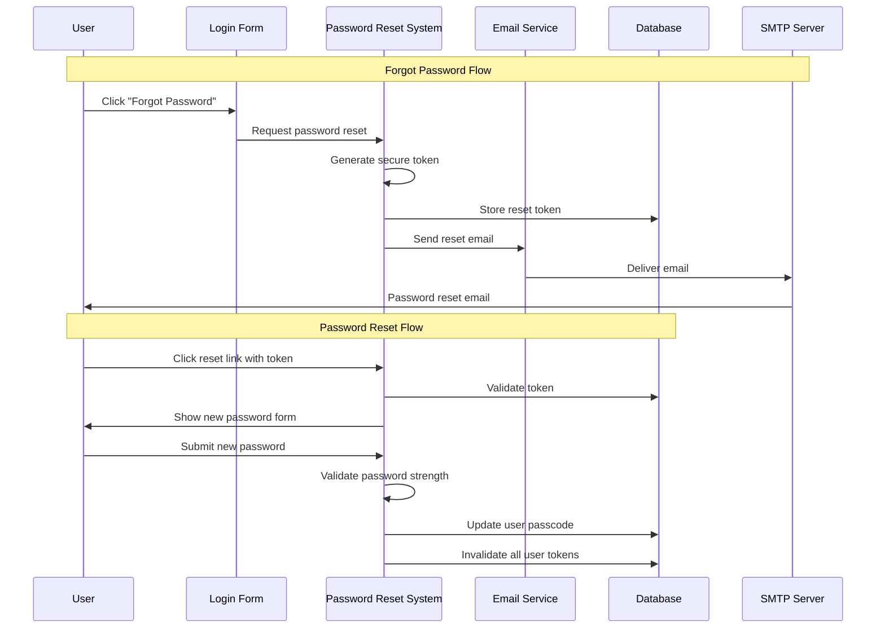
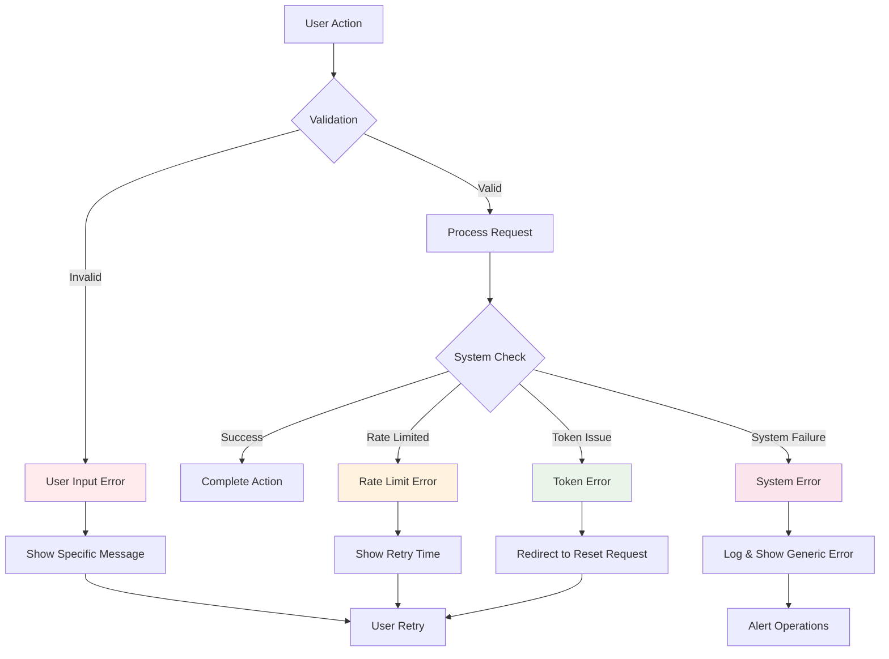

# Technical Design Document: Authentication Enhancements

## Overview

This document outlines the technical design for enhancing the GCC Research Intelligence Platform's authentication system with a forgot password feature and improved form validation. The enhancements build upon the existing passcode-based authentication system while maintaining backward compatibility and strengthening security posture.

The system currently uses bcrypt-hashed passcodes stored in PostgreSQL with Streamlit-based session management. These enhancements add password recovery capabilities, enhanced input validation, and improved user experience without disrupting existing authentication flows.

### Key Components

- **Password Reset System**: Secure token-based password recovery workflow
- **Enhanced Validation**: Robust client-side and server-side input validation
- **Email Service Integration**: SMTP-based password reset notifications
- **Rate Limiting**: Protection against password reset abuse
- **Security Enhancements**: Strengthened password requirements and audit logging

## Architecture

### System Architecture Diagram



### Authentication Flow Enhancement

The enhanced authentication system maintains the existing login flow while adding parallel password recovery capabilities:

1. **Standard Login**: Existing passcode authentication (unchanged)
2. **Forgot Password**: New secure token-based recovery workflow
3. **Password Reset**: Guided new password creation with enhanced validation
4. **Session Management**: Enhanced with password reset audit integration

### Data Flow Architecture



## Components and Interfaces

### 1. Password Reset System (`PasswordResetSystem`)

Central component managing the secure password recovery workflow.

**Core Responsibilities:**
- Reset token generation and validation
- Password strength validation 
- Token lifecycle management
- Integration with email service and rate limiting

**Key Methods:**
```python
class PasswordResetSystem:
    def initiate_reset(self, identifier: str) -> ResetResult
    def validate_token(self, token: str) -> TokenValidation
    def reset_password(self, token: str, new_password: str) -> ResetResult
    def cleanup_expired_tokens(self) -> int
```

**Token Security Model:**
- Cryptographically secure random tokens (256-bit entropy)
- 30-minute expiration window
- Single-use tokens (invalidated after successful reset)
- Secure token storage with proper indexing

### 2. Enhanced Input Validator (`EnhancedInputValidator`)

Extends existing validation with comprehensive password and form validation.

**Validation Rules:**
- Required field validation with real-time feedback
- Password strength requirements (length, character classes)
- Whitespace handling and sanitization
- Cross-field validation support

**Key Methods:**
```python
class EnhancedInputValidator:
    def validate_passcode_input(self, passcode: str) -> ValidationResult
    def validate_password_strength(self, password: str) -> PasswordValidation  
    def validate_reset_identifier(self, identifier: str) -> ValidationResult
    def get_validation_errors(self, form_data: dict) -> List[ValidationError]
```

### 3. Email Service (`PasswordResetEmailService`)

Manages secure email delivery for password reset notifications.

**Features:**
- HTML-formatted professional emails
- Template-based email generation
- Personalized content with user identifiers
- Security warnings and instructions
- SMTP configuration management

**Email Template Structure:**
```
Subject: GCC Research Platform - Password Reset Request
Greeting: Hello [User Identifier]
Reset Link: Secure 30-minute expiration link
Instructions: Step-by-step reset process
Security Warning: Link expiration notice
Support Contact: Technical support information
```

**Key Methods:**
```python
class PasswordResetEmailService:
    def send_reset_email(self, user_id: str, reset_token: str) -> EmailResult
    def generate_reset_link(self, token: str) -> str
    def render_email_template(self, context: dict) -> EmailContent
```

### 4. Rate Limiting System (`ResetRateLimiter`)

Implements intelligent rate limiting to prevent abuse while maintaining usability.

**Rate Limiting Rules:**
- 3 reset attempts per user per hour
- Rate tracking by user identifier (persistent across sessions)
- Automatic rate limit reset after 1-hour window
- Valid token acceptance even under rate limit

**Implementation Strategy:**
- Redis-backed counter system (fallback to database)
- Sliding window rate limiting algorithm
- Per-user rate limit tracking
- Graceful degradation under high load

### 5. Audit Logger (`PasswordResetAuditLogger`)

Comprehensive security event logging for monitoring and compliance.

**Logged Events:**
- All password reset initiation attempts
- Token validation events (success/failure)
- Password change completions
- Rate limit violations
- Suspicious activity patterns

**Log Structure:**
```python
@dataclass
class AuditLogEntry:
    timestamp: datetime
    user_identifier: str
    event_type: str  # 'reset_initiated', 'token_validated', 'password_changed'
    ip_address: Optional[str]
    user_agent: Optional[str]
    success: bool
    details: Dict[str, Any]
```

## Data Models

### Database Schema Changes

The design requires minimal schema modifications to the existing database:

#### 1. Password Reset Tokens Table

```sql
CREATE TABLE password_reset_tokens (
    id SERIAL PRIMARY KEY,
    user_id INTEGER NOT NULL REFERENCES users(id) ON DELETE CASCADE,
    token_hash VARCHAR(255) NOT NULL UNIQUE,
    expires_at TIMESTAMP WITH TIME ZONE NOT NULL,
    created_at TIMESTAMP WITH TIME ZONE NOT NULL DEFAULT NOW(),
    used_at TIMESTAMP WITH TIME ZONE NULL,
    created_ip INET NULL,
    INDEX idx_token_hash (token_hash),
    INDEX idx_user_id_expires (user_id, expires_at),
    INDEX idx_expires_at (expires_at)
);
```

#### 2. Rate Limiting Table

```sql
CREATE TABLE reset_rate_limits (
    id SERIAL PRIMARY KEY,
    user_identifier VARCHAR(255) NOT NULL,
    attempt_count INTEGER NOT NULL DEFAULT 1,
    first_attempt_at TIMESTAMP WITH TIME ZONE NOT NULL DEFAULT NOW(),
    last_attempt_at TIMESTAMP WITH TIME ZONE NOT NULL DEFAULT NOW(),
    UNIQUE INDEX idx_user_identifier (user_identifier),
    INDEX idx_first_attempt (first_attempt_at)
);
```

#### 3. Enhanced Audit Log Table

```sql  
CREATE TABLE password_reset_audit_log (
    id SERIAL PRIMARY KEY,
    timestamp TIMESTAMP WITH TIME ZONE NOT NULL DEFAULT NOW(),
    user_identifier VARCHAR(255) NOT NULL,
    event_type VARCHAR(50) NOT NULL,
    ip_address INET NULL,
    user_agent TEXT NULL,
    success BOOLEAN NOT NULL,
    details JSONB NULL,
    INDEX idx_timestamp (timestamp),
    INDEX idx_user_identifier (user_identifier),
    INDEX idx_event_type (event_type)
);
```

#### 4. Users Table Enhancement

```sql
-- Add password history for preventing reuse
ALTER TABLE users 
ADD COLUMN password_history JSONB NULL,
ADD COLUMN last_password_change TIMESTAMP WITH TIME ZONE NULL;
```

### Data Transfer Objects

#### ResetTokenData

```python
@dataclass
class ResetTokenData:
    token: str
    user_id: int
    expires_at: datetime
    created_at: datetime
    used: bool = False
    
    def is_expired(self) -> bool:
        return datetime.now(timezone.utc) > self.expires_at
    
    def is_valid(self) -> bool:
        return not self.used and not self.is_expired()
```

#### PasswordValidationResult

```python
@dataclass
class PasswordValidationResult:
    is_valid: bool
    errors: List[str]
    strength_score: int  # 0-100
    meets_length_req: bool
    meets_uppercase_req: bool
    meets_lowercase_req: bool
    meets_number_req: bool
    meets_special_char_req: bool
```

#### RateLimitStatus

```python
@dataclass
class RateLimitStatus:
    attempts_used: int
    max_attempts: int
    reset_time: datetime
    is_limited: bool
    
    @property
    def attempts_remaining(self) -> int:
        return max(0, self.max_attempts - self.attempts_used)
```

## Correctness Properties

*A property is a characteristic or behavior that should hold true across all valid executions of a system-essentially, a formal statement about what the system should do. Properties serve as the bridge between human-readable specifications and machine-verifiable correctness guarantees.*

### Property 1: Reset Token Security
*For any* password reset request with valid user identifier, the system SHALL generate a cryptographically secure token that remains valid for exactly 30 minutes from creation time and becomes invalid after single use.
**Validates: Requirements 1.4, 1.5, 1.10**

### Property 2: Password Validation Consistency
*For any* password input during reset, the validation system SHALL consistently apply all security requirements (minimum 8 characters, uppercase, lowercase, digit, special character) and provide specific feedback for each unmet criterion.
**Validates: Requirements 3.1, 3.2, 3.3, 3.4, 3.5, 3.6**

### Property 3: Input Validation Completeness
*For any* form submission with empty or whitespace-only passcode input, the validator SHALL prevent submission and display the required field error message while maintaining consistent validation state.
**Validates: Requirements 2.2, 2.3, 2.7, 2.8**

### Property 4: Token Invalidation Safety
*For any* successful password reset completion, the system SHALL invalidate all existing reset tokens for that user while preserving tokens for other users.
**Validates: Requirements 1.10**

### Property 5: Rate Limiting Fairness
*For any* user making password reset requests, the system SHALL accurately track attempts per user per hour and enforce the 3-attempt limit while allowing valid token usage even under rate limiting.
**Validates: Requirements 5.1, 5.3, 5.4, 5.6**

### Property 6: Email Content Consistency
*For any* password reset email generation, the email SHALL contain all required elements (subject line, user identifier, reset link, expiration warning, instructions, support contact) with proper HTML formatting.
**Validates: Requirements 4.1, 4.2, 4.3, 4.4, 4.5, 4.6, 4.8**

### Property 7: Error State Management
*For any* validation error state in the login form, the system SHALL immediately clear error styling when user begins input and maintain proper button state based on field validity.
**Validates: Requirements 2.5, 2.6**

### Property 8: Audit Logging Completeness
*For any* password reset system operation (initiation, validation, completion, rate limit violation), the system SHALL create an audit log entry with complete event details for security monitoring.
**Validates: Requirements 1.11, 5.5**

### Property 9: Password Hash Security
*For any* new password set during reset process, the system SHALL hash the password using bcrypt with salt before database storage and prevent reuse of the previous password.
**Validates: Requirements 3.7, 3.8**

### Property 10: Token State Validation
*For any* reset link access attempt, the system SHALL correctly validate token existence, expiration status, and usage state, displaying appropriate forms or error messages based on token validity.
**Validates: Requirements 1.7, 1.8**

## Error Handling

### Error Categories and Responses

#### 1. User Input Errors
- **Invalid Email/Username**: Clear message with suggestion to check spelling
- **Weak Password**: Specific feedback on each unmet requirement
- **Empty Fields**: Real-time validation with field highlighting
- **Recovery**: Immediate feedback with actionable guidance

#### 2. Token-Related Errors  
- **Expired Token**: Redirect to request new reset with explanation
- **Invalid Token**: Security-conscious error message without details
- **Already Used Token**: Clear message directing to request new reset
- **Recovery**: Automatic redirect to reset request form

#### 3. Rate Limiting Errors
- **Limit Exceeded**: Clear message with retry time information
- **Progressive Messaging**: Warnings at 2/3 attempts used
- **Recovery**: Display exact wait time and alternative contact methods

#### 4. System Errors
- **Email Service Failure**: Generic retry message with support contact
- **Database Errors**: Graceful fallback with error logging
- **Network Issues**: Retry mechanisms with exponential backoff
- **Recovery**: Comprehensive error logging with alert mechanisms

### Error Handling Architecture



## Testing Strategy

### Dual Testing Approach

The authentication enhancements will employ both property-based testing and example-based unit testing to ensure comprehensive coverage and correctness:

**Property-Based Testing**: 
- Validates universal properties across all possible inputs using randomized test data
- Configured to run minimum 100 iterations per property test  
- Each property test references its corresponding design document property
- Tag format: **Feature: authentication-enhancements, Property {number}: {property_text}**

**Unit Testing**:
- Validates specific examples, edge cases, and integration points
- Focuses on concrete scenarios and error conditions
- Tests component interactions and boundary conditions
- Complements property tests with deterministic scenarios

### Testing Framework and Configuration

**Property-Based Testing Framework**: Hypothesis (Python)
- Chosen for mature Python ecosystem integration
- Excellent Streamlit application compatibility  
- Rich generator library for authentication scenarios
- Built-in shrinking for minimal counterexamples

**Test Categories**:

1. **Security Properties** (Property-based)
   - Token generation entropy and uniqueness
   - Password hashing consistency and salt verification
   - Session token security across user sessions

2. **Validation Properties** (Property-based)  
   - Input validation across all password combinations
   - Form validation state management
   - Error message consistency

3. **Integration Examples** (Unit testing)
   - Email service SMTP configuration
   - Database transaction handling  
   - Streamlit component integration

4. **Edge Case Examples** (Unit testing)
   - Clock skew in token expiration
   - Database connection failures
   - Concurrent reset attempts

### Property Test Implementation Examples

```python
from hypothesis import given, strategies as st

@given(st.text(min_size=1))
def test_reset_token_generation_uniqueness(user_identifier):
    """Feature: authentication-enhancements, Property 1: Reset Token Security"""
    # Generate multiple tokens for same user
    token1 = password_reset_system.generate_reset_token(user_identifier)
    token2 = password_reset_system.generate_reset_token(user_identifier)
    
    # Tokens must be unique even for same user
    assert token1 != token2
    assert len(token1) >= 32  # Minimum entropy requirement
    assert password_reset_system.is_valid_token_format(token1)

@given(st.text())
def test_password_validation_completeness(password_input):
    """Feature: authentication-enhancements, Property 2: Password Validation Consistency"""
    result = enhanced_validator.validate_password_strength(password_input)
    
    # All validation aspects must be checked
    assert hasattr(result, 'meets_length_req')
    assert hasattr(result, 'meets_uppercase_req') 
    assert hasattr(result, 'meets_lowercase_req')
    assert hasattr(result, 'meets_number_req')
    assert hasattr(result, 'meets_special_char_req')
    
    # Error messages must be specific to unmet requirements
    if not result.is_valid:
        assert len(result.errors) > 0
        assert all(error.strip() for error in result.errors)
```

### Test Data Management

**Sensitive Data Handling**:
- No real passwords or tokens in test fixtures
- Synthetic test data generation for all scenarios
- Secure cleanup of temporary test data
- Isolated test database for integration tests

**Test Environment Setup**:
- Dockerized test environment for consistency
- Mock SMTP server for email testing
- In-memory Redis for rate limiting tests
- Automated test database migrations

### Performance and Load Testing

**Rate Limiting Load Tests**:
- Concurrent reset request handling
- Rate limit accuracy under high load
- Memory usage during peak reset periods
- Database connection pooling efficiency

**Email Service Performance**:
- SMTP connection pooling efficiency
- Email queue processing rates  
- Failover mechanism validation
- Template rendering performance